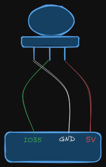

# Phillips Hue Motion Trigger

## Hardware setup

### Microcontroller

- ESP32-WROOM-32
- PIR motion sensor



### Lights

- Phillips Hue light bars

## Setup the python environment

```bash
python -m venv .venv
source .venv/bin/activate
pip install -r requirements.txt
```

## Install / Configure the Arduino CLI

https://github.com/arduino/arduino-cli
https://docs.espressif.com/projects/arduino-esp32/en/latest/installing.html

## Add secrets

Create the file **hue-motion-light/secrets.h** and add the following variables

```text
const char* HUE_IP = "<Hue bridge API address>";
const char* HUE_USERNAME = "<Hue username / API key>";
const char* WIFI_SSID = "<Wifi SSID>";
const char* WIFI_PASSWORD = "<Wifi password>";
```

### Finding the bridge IP Address
...

### Finding the username / key
...

## Uploading sketch

You may need to edit the following variables in the Makefile

```text
fqbn = esp32:esp32:uPesy_wroom # Fully 
usb_port = /dev/ttyUSB0
serial_port = 9600
```

### Fully Qualified Board Name (fqbn)

Determine the fqbn for the board you are using

```bash
# Try find your board... e.g.
arduino-cli board listall esp32
```

### USB Port

```bash
# Determine USB port device is on
arduino-cli board list
```

## Make 

A Makefile is provided to document various commands and simplify processes

**Note**: Remember to edit the Makefile variables to suit your environment

```bash
# Compile the .ino program
make compile

# Upload the binaries to the board
make upload

# List the currently connected boards 
make info

# Compile, upload and monitor all in one handy command
make test 
```

## Serial monitoring

```bash
# Start screen session
screen <usb port> <serial port>

# Example
screen /dev/ttyUSB0 9600
```

To quit the session run *<ctrl-a> ":quit"*

## Common Problems

### Could not open <USB PORT> ... the port doesn't exist
- See if the USB Port changed...
```bash
make info
```
- Try reconnecting the usb


